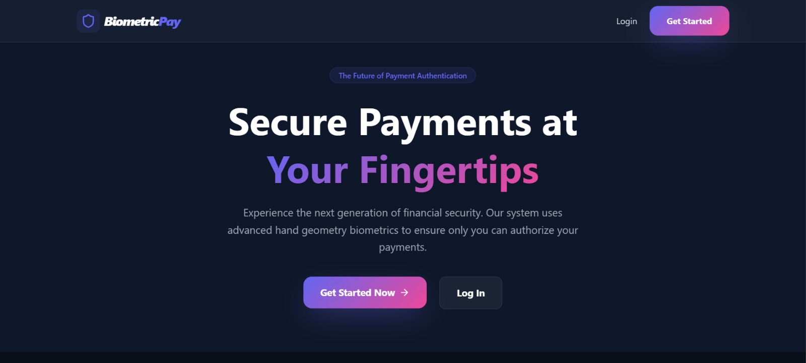
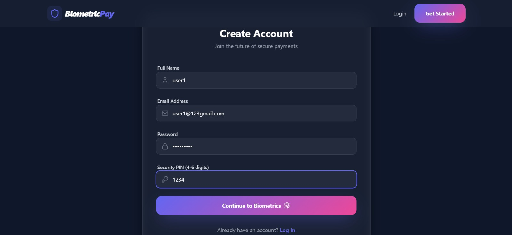
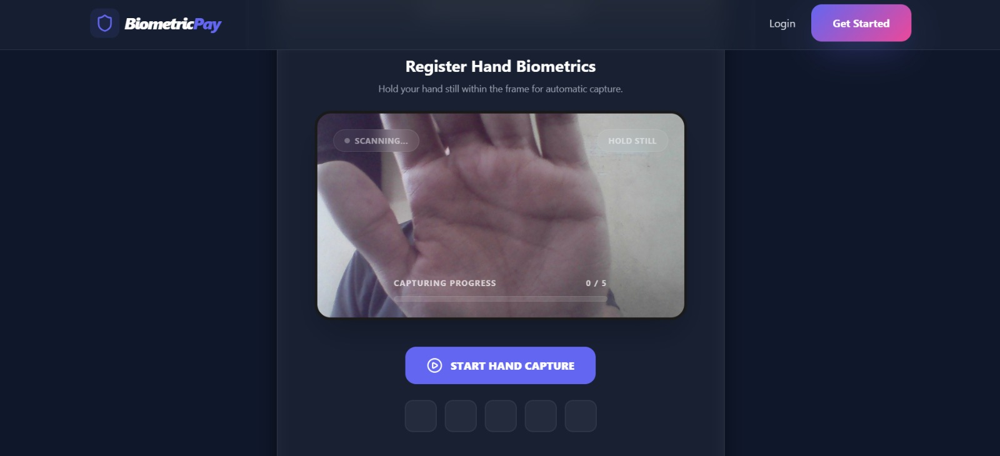
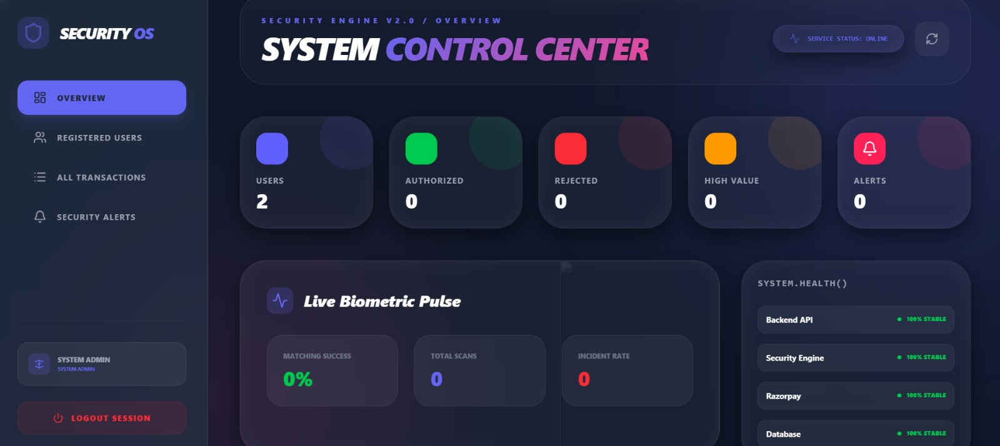
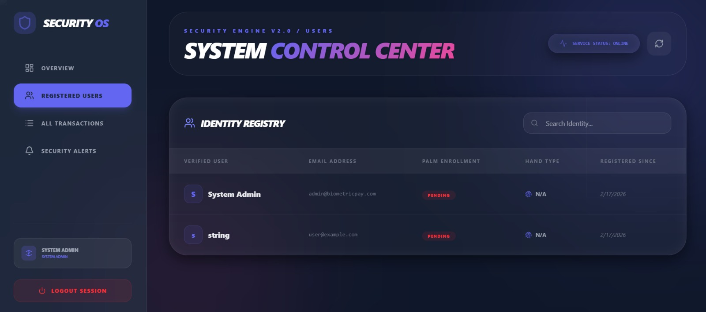
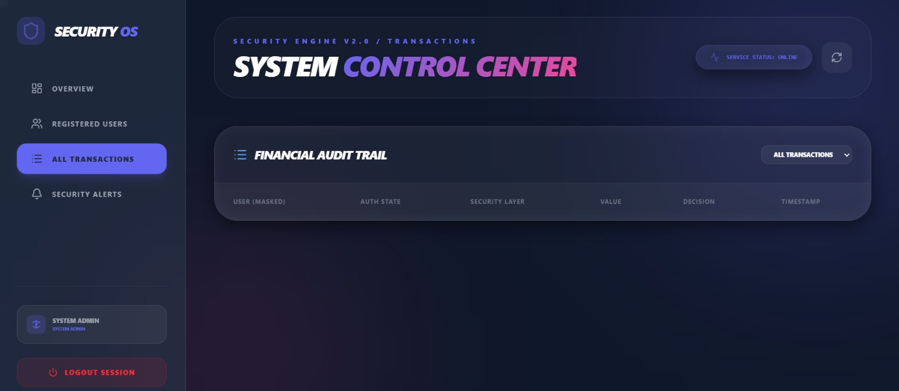
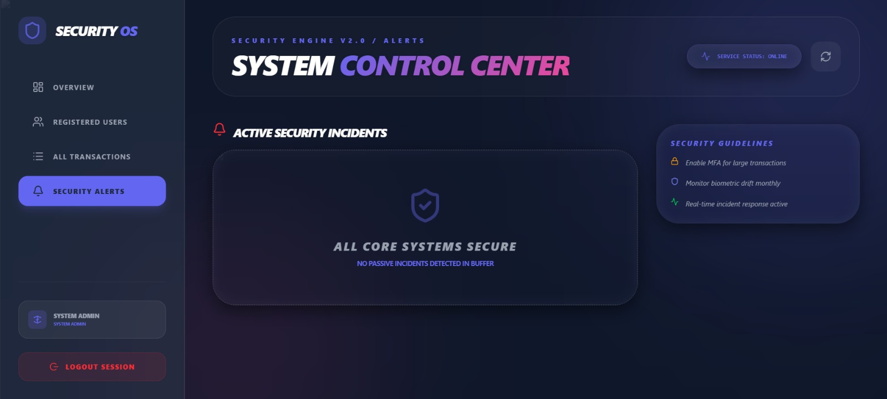

# PalmPay Frontend (Electron App)

## Overview

This is the **desktop frontend application** for PalmPay, built using **Electron + React (Vite)**. It provides a secure and immersive interface for biometric authentication, transaction flows, and system monitoring.

Unlike a typical web app, this frontend runs as a **native desktop application**, enabling direct access to device hardware (camera) for real-time biometric capture.

---

## Features

* Desktop app powered by **Electron**
* Real-time **hand biometric capture** (MediaPipe + Webcam)
* **5-step payment workflow**
* **Risk-based authentication UI** (Biometric / PIN / OTP)
* Advanced **Admin Dashboard (Security OS)**
* Smooth UI with **Framer Motion animations**
* Clean, modern **Tailwind-based design system**

---

## Tech Stack

* **Electron** (Desktop runtime)
* **React 19 + Vite**
* **Tailwind CSS**
* **Framer Motion**
* **MediaPipe (Hands Detection)**
* **React Webcam**
* **Axios (API calls)**

---

## Project Structure

```
frontend/
├── electron/
│   └── main.js           # Electron main process
├── src/
│   ├── components/       # UI components
│   ├── pages/            # Screens (Dashboard, Auth, etc.)
│   ├── services/         # API layer
│   ├── hooks/            # Custom hooks
│   └── main.jsx          # React entry
├── public/
├── package.json
├── vite.config.js
└── flake.nix             # Frontend-specific Nix environment
```

---

## Setup

### 1. Install dependencies

```bash
npm install
```

---

## Running the Application

### Step 1: Start React Dev Server

```bash
npm run dev
```

### Step 2: Launch Electron (new terminal)

```bash
npm run electron
```

---

## Build

```bash
npm run build
```

> Production Electron packaging is not configured by default.

---

## Environment Configuration

This project uses a **single root-level `.env` file** (monorepo setup).

Example:

```env
VITE_API_BASE_URL=http://localhost:8000
```

Ensure the root `.env` is configured before running the frontend.

---

## Nix Environment (Optional)

This directory includes its own **`flake.nix`** for isolated frontend development.

### Enter frontend shell

```bash
nix develop
```

Includes:

* Node.js 22
* npm
* Git

This avoids installing Node globally and ensures a consistent environment.

---

## Screenshots

### Landing Page



### Create Account



### Biometric Registration



### Admin Dashboard (Overview)



### User Registry



### Transactions Audit



### Security Alerts



---

## Notes

* Backend must be running before launching Electron
* Camera permissions are required for biometric capture
* Ensure correct API base URL (from root `.env`)
* Works best on modern Linux/Windows environments

---

## Future Improvements

* Electron packaging (AppImage / .exe)
* Auto-updater support
* WebSocket-based real-time updates
* Improved hardware acceleration for camera feed
